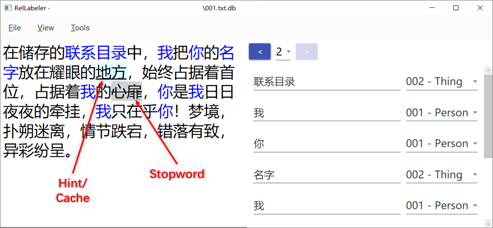

# RelLabeler

*An Annotation Tool for Named Entity Recognition (NER)*

## Concepts

- **Entity (Blue/Green Bold Text)**
- **Cache Entry (Light Blue Highlighted, Underlined Text)**: Previously annotated entities.
- **Hint (Light Blue Highlighted, Underlined Text)**: Words that should be paid special attention to.
- **Stopword (Light Gray Highlighted, Strikethrough Text)**: Words that should not be included in entities.

## Shortcuts

*Select some text first...*

- **Annotate/Unannotate All (`[Space]`)**: Entities (in the current page) matched the selected text will **ALL** become annotated/unannotated.
- **Annotate/Unannotate Single (`Ctrl` + `[Space]`)**: **Only** the selected entity will become annotated/unannotated.
- **Search (`Ctrl` + `F`)**
- **Add Hint (`Ctrl` + `W`)**
- **Remove Hint (`Ctrl` + `Shift` + `W`)**
- **Add Stopword (`Ctrl` + `Q`)**
- **Remove Stopword (`Ctrl` + `Shift` + `Q`)**
- **Remove Cache Entry (`Ctrl` + `Shift` + `D`)**

*Notes:*

- *`Ctrl` or `Shift` refers to left `Ctrl` or left `Shift` only.*
- *Selected text will automatically be available in clipboard.*
- *When focused in the textbox (on the left side of the main window), `E` and `R` are used to go to previous page and next page, respectively.*

## FAQ

- Supported OS?
  > Windows 10

- The exception of failure to load DLL occurred when opening a file.
  > Copying the directory `./packages/SQLitePCLRaw.lib.e_sqlite3.2.0.4/runtimes` to `./RelLabeler/bin/Debug/runtimes` should solve the problem.

